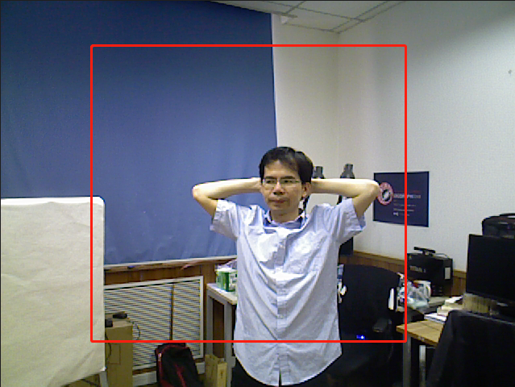

# DDRNet_evaluation

## Config
From test.csv
info:
1. raw depth
2. high quality depth
3. RGB/color
4. mask

From evaluate.py args
- dnnet = convResnet
- dtnet = hypercolumn
- sample_dir = ../sample
- checkpoint_dir = ../download/split/
- csv_path = ../dataset/test.csv
- low_thres = 500
- up_thres = 3000
- image_size = 400

Others
parser.add_argument("--gpu", dest="gpu", action="store_true") -> store true if gpu in args -> gpu = False
- gpu = False
- loop = False
- num_threads = 1

## loop

### preprocessing
raw.size = 480 x 640 (H, W)

rgb = Image.open(color_path).convert('L').resize(raw.size) -> convert to greyscale
L = R * 299/1000 + G * 587/1000 + B * 114/1000

utils.center_crop(raw, gt, rgb, mask, config.image_size)

low_thres, high_thres = 500, 3000
thres_range = (up_thres - low_thres) / 2.0 = 1250
raw = np.clip(np.array(raw, dtype=np.float32), low_thres, up_thres)
raw = (raw - low_thres) / thres_range - 1.0
np.clip: Given an interval, values outside the interval are clipped to the interval edges.

all_ims : [(name, raw, gt, rgb, mask)]

### load model
params = build_model(config.image_size, config.image_size, config)
sess = tf.Session()
load_from_checkpoint(sess, path)
for i, (name, raw, _, rgb, mask) in enumerate(all_ims): # not using high quality depth in evaluating
    t_elapsed = loop_body_patch_time(sess, name, params, raw, rgb, mask, config)

dn denoising
dt refinement

### build model
add padding to depth_in and color
not using denoising net -> config.dnnet == "None"
depth_dn, end_pts, weight_vars = dnnet(depth_in_pad, is_training, aux=None, scope="dn_net")
depth_dt, end_pts, weight_vars = dtnet(depth_dn, color_pad)
remove padding and reshape output
return placeholder model

### loop_body_patch_time
feed_dict = {params["depth_in"]: depth_in,
             params["color"]: color,
             params["is_training"]: False}
feed feed_dict to placeholder model
depth_dn_im = sess.run(params["depth_dn"], feed_dict=feed_dict)
depth_dt_im = sess.run(params["depth_dt"], feed_dict=feed_dict)
depth_dn_im = (((depth_dn_im + 1.0) * thres_range + low_thres) * mask).astype(np.uint16)
depth_dt_im = (((depth_dt_im + 1.0) * thres_range + low_thres) * mask).astype(np.uint16)
run and revet preprocessing, save
