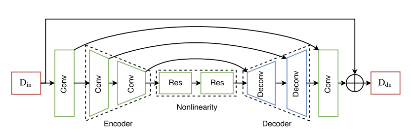
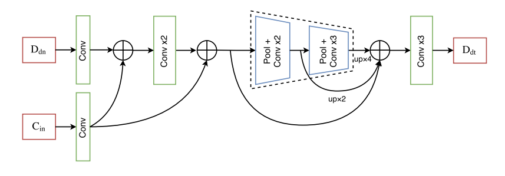

# DDRNet_train

## Config
From train.csv
info:
1. raw depth
2. high quality depth
3. RGB/color
4. (optional) mask
5. (optional) abd

From train.py args
- logdir=log/test
- checkpoint_basename=test
- index_file=../dataset/train.csv
- dnnet=convResnet
- dtnet=hypercolumn
- batch_size=16
- image_size=256
- aux_type='PNG'
- rand_crop = True
- rand_flip = True
- rand_depth_shift = True
- diff_thres=2.5
- low_thres=500
- up_thres=3000
- learning_rate=0.001
- max_steps=6000
- save_model_steps=200

Others
- has_mask = True
- has_abd = False
- dnstop = False
- diff_thres = 2
- low_thres = 500
- up_thres = 3000
- rand_scale = False
- rand_brightness = False
- grad_clip = False
- beta1 = 0.5
- epsilon = 0.0001
- num_threads = 4
- min_after_dequeue = 128
- use_shuffle_batch = True
- max_to_keep = 100
- summary_every_n_steps = 20

## process
depth_raw_data (?, ?, 1)
concated_im = tf.concat([depth_raw_im, depth_ref_im, color_im, mask], axis=2) concated_im (?, ?, 4)
concated_im = tf.random_crop(concated_im, [output_height, output_width, n_concat]) concated_im (256, 256, 4)
depth_raw_batch, depth_ref_batch, color_batch, mask_batch, albedo_batch = tf.split(im_batch, n_concat, axis=3)
depth_raw_batch (?, 256, 256, 1)

depth_dn, _, _ = dnnet(depth_raw, is_training, aux=None, scope="dn_net")
depth_dt, _, w_dt = dtnet(tf.stop_gradient(depth_dn, name='depth_dn_stopped') if config.dnstop else depth_dn, color)

depth_raw(batch) -> dnnet -> depth_dn(?, 256, 256, 1) -> depth_dt(?, 256, 256, 1)

normals_dn = ops.compute_normals(depth_dn, config, conv=False) normals_dn (16, 3, 256, 256)

loss, self.loss1, self.loss2, dbg_ret = model.loss(depth_dn, depth_dt, depth_ref, config,
                                                    normal_dn=normals_dn, normal_dt=normals_dt,
                                                    normal_gt=normals_ref, color=color,
                                                    mask=params["mask"], abd=params["abd"])

normals_dn added_codes, change back to (16, 3, 256, 256)

## dnnet convResnet


x(depth_raw)(?, 256, 256, 1) ->  cnv0
cnv(?, 256, 256, 32) -> cnv_down0
cnv(?, 128, 128, 64) -> cnv_down1
cnv(?, 64, 64, 128) -> res0
cnv(?, 64, 64, 128) -> res1
cnv(?, 64, 64, 128) -> cnv_up1 -> cnv(?, 64, 64, 256)
cnv(?, 128, 128, 64) -> cnv_up2 -> cnv(?, 128, 128, 128)
cnv(?, 256, 256, 32) -> cat_final
cnv(?, 256, 256, 64) -> cnv_final
cnv(?, 256, 256, 1) ->
out(?, 256, 256, 1)

```python
cnv = slim.conv2d(x, ngf, [3, 3], scope='cnv0')
mult = 1
for i in range(n_down):
    mult *= 2
    cnv = slim.conv2d(cnv, ngf * mult, [3, 3], stride=2, scope='cnv_down{}'.format(i))
    scale_skips.append(cnv)
# mult = 4
for i in range(n_blocks):
    cnv = ops.residual_block(cnv, ngf * mult, norm_fn=None, scope='res{}'.format(i))
# mult = 4
for i in range(n_down):
    mult = mult // 2
    cnv = tf.concat([scale_skips[-1], cnv], cat_axis, name='cat{}'.format(i + 1))
    scale_skips.pop()
    cnv = slim.conv2d_transpose(cnv, ngf * mult, [3, 3], stride=2, scope='cnv_up{}'.format(i))
cnv = tf.concat([scale_skips[0], cnv], cat_axis, name='cat_final')
cnv = slim.conv2d(cnv, 1, [3, 3], activation_fn=tf.nn.tanh, normalizer_fn=None, scope='cnv_final')
out = tf.clip_by_value(x + cnv, -1, 1) # residual
```

## dtnet: hypercolumn


depth(?, 256, 256, 1) -> cnv1_d(?, 256, 256, 8)
color(?, 256, 256, 1) -> cnv1_c(?, 256, 256, 8)
cnv1(concat depth, color)(?, 256, 256, 16) -> cnv2(?, 256, 256, 16) ->
hyper1(concat cnv1, cnv2)(?, 256, 256, 32) ->
poo1(?, 128, 128, 32) -> cnv3(?, 128, 128, 32) -> cnv4(?, 128, 128, 32) -> resize
up1(resize)(?, 256, 256, 32)
hyper2(concat cnv3, cnv4)(?, 128, 128, 64) ->
pool2(?, 64, 64, 64) -> cnv5(?, 64, 64, 64) -> cnv6(?, 64, 64, 64) -> cnv7(?, 64, 64, 64)
up2(resize)(?, 256, 256, 64)
cat(concat cnv2, up1, up2)(?, 256, 256, 112) ->
cnv8(?, 256, 256, 16) -> cnv8(?, 256, 256, 4) ->
out(?, 256, 256, 1)

## loss

total_loss: 'dn_maskedLoss', 'dt_fidelityLoss', 'dt_shadingLoss'

## loss1: masked loss -> ddnet and dtnet(fidelityLoss)
tf.losses.huber_loss(gt, output, weights=weights, delta=huber, loss_collection=LOSSES_COLLECTION) ignored in this example
tf.losses.absolute_difference(gt, output, weights=weights, loss_collection=LOSSES_COLLECTION) L1 error
tf.losses.mean_squared_error(gt, output, weights=weights, loss_collection=LOSSES_COLLECTION) L2 error
normal_dot_loss not used(described in paper)

## loss2: shading loss -> dtnet
input normal_dn and normal_gt
not used?

loss_smo not used(described in paper)